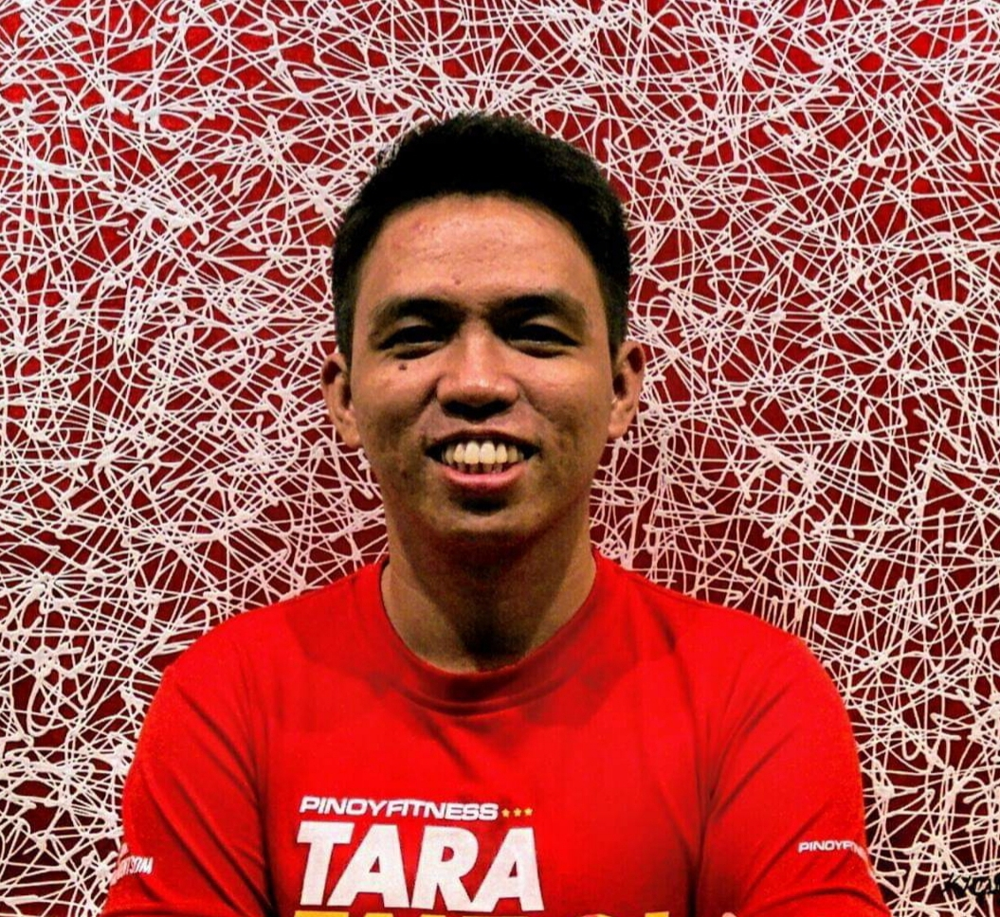

---
# You don't need to edit this file, it's empty on purpose.
# Edit theme's home layout instead if you wanna make some changes
# See: https://jekyllrb.com/docs/themes/#overriding-theme-defaults
layout: page
---

Hi, I'm Aj De Guzman and thanks for dropping by!

I work for [Accenture](https://www.accenture.com/ph-en) where I have the exceedingly inappropriate title of "Software Engineer". I thought it would be nice to share everything of my works and outdoor activities so I'm writing it here. When I'm not tossing keyboard, I'm trail running, hiking, or watching Netflix. In my spare time, you can also find me answering questions in [MuleSoft Community Forum](https://help.mulesoft.com/s/profile/0052T00000BzGrSQAV)

This site is built with [Jekyll](https://jekyllrb.com) and is hosted on Github Pages. You can fork it [here.](https://github.com/ajdeguzman/ajdeguzman.github.io)
